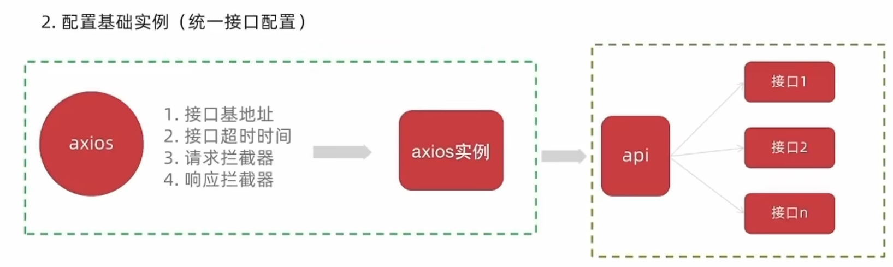
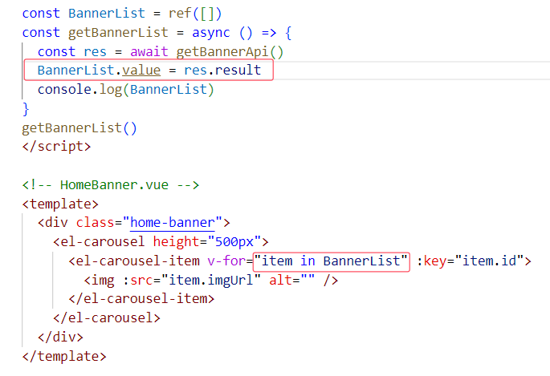

# vue-rabbit

## axios配置


## eslint+prettier
+ 禁用格式化插件prettier， format on save关闭
+ 安装Eslint插件，并在setting中配置保存时自动修复
```
"editor.codeActionsOnSave": {"source.fixAll":true },
```
+.eslintrc.cjs中对rules添加配置参考如下：
```
rules: {
    'prettier/prettier': [
      'warn',
      {
        singleQuote: true, // 单引号
        semi: false, // 无分号
        printWidth: 80, // 每行宽度至多80字符
        trailingComma: 'none', // 不加对象|数组最后逗号
        endOfLine: 'auto' // 换行符号不限制（win mac 不一致）
      }
    ],
  }
```
## 图片懒加载
+ 封装插件
```
import { useIntersectionObserver } from "@vueuse/core";

export const lazyPlugin = {
    install(app) {
        //懒加载指令逻辑
        app.directive('img-lazy', {
            mounted(el, binding) {
                //el:指令绑定的那个元素 img
                //binding：binding》value 指令等于号后面绑定的表达式的值 图片url
                console.log(el, binding.value)
                useIntersectionObserver(
                    el,  //监听的元素el
                    ([{ isIntersecting }]) => {   //isIntersecting 布尔值
                        console.log(isIntersecting)  //图片进入视口区域，那么isIntersecting为true，否则false
                        if (isIntersecting) {
                            //进入视口区域
                            el.src = binding.value
                        }
                    }
                )
            }
        })
    }
}
```
+ 在main.js中注册
```
import { lazyPlugin } from './directives'
app.use(lazyPlugin)
```
+ 在完成第一次加载后停止监听
```
const { stop } = useIntersectionObserver(
                    el,  //监听的元素el
                    ([{ isIntersecting }]) => {   //isIntersecting 布尔值
                        //console.log(isIntersecting)  //图片进入视口区域，那么isIntersecting为true，否则false
                        if (isIntersecting) {
                            //进入视口区域
                            el.src = binding.value
                            stop()   //结构出的停止监听的方法
                        }
                    }
                )

```

## 遇到的坑
### 这里不能写BannerList.value


### vue中组件加冒号的，说明后面的是一个变量或者表达式，没加冒号的后面就是对应的字符串字面量，所以注意以下转为动态路由后to前一定要加冒号！
```
<RouterLink :to="`/category/${item.id}`">{{ item.name }}</RouterLink>
```
### 当用户访问/user/123时，$route.params.id将显示为123


