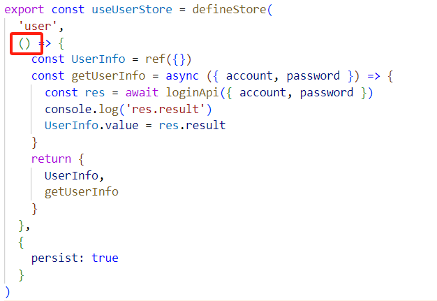

# vue-rabbit

## axios配置


## eslint+prettier
+ 禁用格式化插件prettier， format on save关闭
+ 安装Eslint插件，并在setting中配置保存时自动修复
```
"editor.codeActionsOnSave": {"source.fixAll":true },
```
+ .eslintrc.cjs中对rules添加配置参考如下：
```
rules: {
    'prettier/prettier': [
      'warn',
      {
        singleQuote: true, // 单引号
        semi: false, // 无分号
        printWidth: 80, // 每行宽度至多80字符
        trailingComma: 'none', // 不加对象|数组最后逗号
        endOfLine: 'auto' // 换行符号不限制（win mac 不一致）
      }
    ],
  }
```
## 图片懒加载
+ 封装插件
```
import { useIntersectionObserver } from "@vueuse/core";

export const lazyPlugin = {
    install(app) {
        //懒加载指令逻辑
        app.directive('img-lazy', {
            mounted(el, binding) {
                //el:指令绑定的那个元素 img
                //binding：binding》value 指令等于号后面绑定的表达式的值 图片url
                console.log(el, binding.value)
                useIntersectionObserver(
                    el,  //监听的元素el
                    ([{ isIntersecting }]) => {   //isIntersecting 布尔值
                        console.log(isIntersecting)  //图片进入视口区域，那么isIntersecting为true，否则false
                        if (isIntersecting) {
                            //进入视口区域
                            el.src = binding.value
                        }
                    }
                )
            }
        })
    }
}
```
+ 在main.js中注册
```
import { lazyPlugin } from './directives'
app.use(lazyPlugin)
```
+ 在完成第一次加载后停止监听
```
const { stop } = useIntersectionObserver(
                    el,  //监听的元素el
                    ([{ isIntersecting }]) => {   //isIntersecting 布尔值
                        //console.log(isIntersecting)  //图片进入视口区域，那么isIntersecting为true，否则false
                        if (isIntersecting) {
                            //进入视口区域
                            el.src = binding.value
                            stop()   //结构出的停止监听的方法
                        }
                    }
                )

```
## 更新路由缓存，实现一点就跳转，不需要再次刷新页面
```
const getNewCategoryList = async (id) => {
  const res = await getCategoryApi(id)
  CategoryList.value = res.result
}
onBeforeRouteUpdate((to) => {
  getNewCategoryList(to.params.id)
})
```
## 切换路由，自动滚动到页面的顶部


## 遇到的坑及一些经验
### 这里不能写BannerList.value


### vue中组件加冒号的，说明后面的是一个变量或者表达式，没加冒号的后面就是对应的字符串字面量，所以注意以下转为动态路由后to前一定要加冒号！但是用ref调用组件实例时，ref前不能加冒号！
```
<RouterLink :to="`/category/${item.id}`">{{ item.name }}</RouterLink>
```
### 当用户访问/user/123时，$route.params.id将显示为123

### 对于响应式ref的.value属性，在javascript结构中都需要写出，而在template模版中就不需要再写，因为vue会自动解包


### 通过v-for对Good-item组件进行复制传参：
```
  <GoodItem
          :goods="goods"
          v-for="goods in BaseList"
          :key="goods.id"
        ></GoodItem>
```

### 在设计无限滚动时，一定需要设置两个变量,在调接口时传入BaseData，返回值用BaseList接收，否则调用接口的返回值会不符合传入接口的数据的规定结构，报错！
```
const BaseList = ref([])
const BaseData = ref({
  category: route.params.id,
  page: 10,
  pageSize: 20,
  sortField: 'publishTime'
})
...
 const res = await getBaseListApi(BaseData.value) 
...
 BaseList.value = res.result.items
...
 const res = await getBaseListApi(BaseData.value)
 BaseList.value = [...BaseList.value, ...res.result.items]
```

### 对下述代码，序号a输出结果不为空，序号b输出结果为空，原因在于由于await存在使请求api过程中b句先执行。由此可以推断出在onmounted中调用getGoods()的原因：保证getGoods()的执行顺序，防止意外情况？


### 调用pinia仓库中函数时，外层括号不用传参

